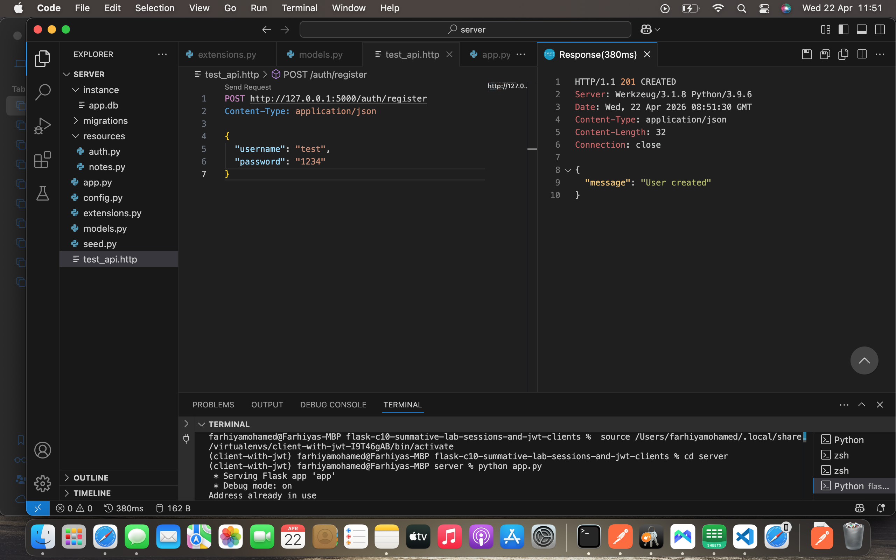
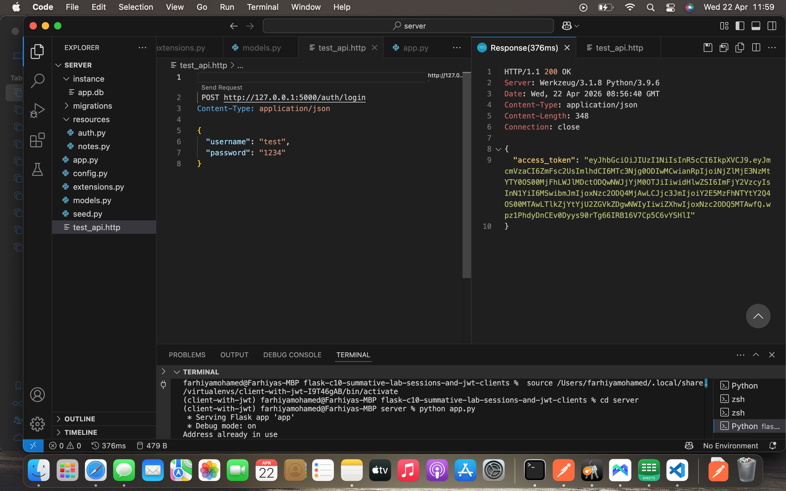

# Flask JWT Notes API (Summative Lab)

##  Project Description
This project is a Flask RESTful API that implements secure user authentication using JWT. Users can register, login, and manage their own personal notes. Each note belongs to a user and cannot be accessed by other users.

---

##  Features
- User registration
- User login with JWT authentication
- Create notes
- Read notes (with pagination)
- Update notes
- Delete notes
- Secure route protection (user isolation)

---

## Tech Stack
- Python Flask
- Flask SQLAlchemy
- Flask-Migrate
- Flask-Bcrypt
- Flask-JWT-Extended
- SQLite database

---

##  Project Structure
server/
│── app.py
│── config.py
│── models.py
│── extensions.py
│── resources/
│   ├── auth.py
│   ├── notes.py
│── migrations/

---

## Installation Instructions

### 1. Clone repository
```bash
git clone 
cd flask-c10-summative-lab-sessions-and-jwt-clients
## 2. Install dependencies
pipenv install
pipenv shell

3. Run migrations
cd server
flask db init
flask db migrate -m "init"
flask db upgrade

4. Run server
python app.py
🔐 Authentication Flow
Register
POST /auth/register
Login
POST /auth/login
Returns:
{
  "access_token": "your_jwt_token"
}
Use token in headers:
Authorization: Bearer <token>
 API Endpoints
Auth
POST /auth/register
POST /auth/login
Notes
GET /notes?page=1
POST /notes
PATCH /notes/<id>
DELETE /notes/<id>
 Security
Passwords are hashed using Bcrypt
JWT authentication protects all note routes
Users can only access their own notes

 Author
Farhiya Mohamed

---

— FINAL GIT PUSH (SUBMISSION)

Now run:

```bash id="git1"
git add .
git commit -m "Final Flask JWT API submission"
git push origin main

##  Screenshots

### Server Running


### API Testing

